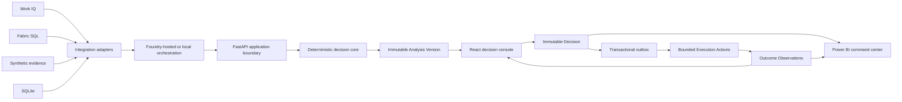

# Supply Response

Supply Response is a decision-support demonstration for managing a fictional supplier disruption from detection through analysis, human approval, bounded execution, and outcome observation.

The project combines a deterministic supply-response core with a FastAPI application, a React decision console, durable SQLite or Fabric SQL persistence, and a two-page Power BI project. Microsoft 365 and Azure integrations are added through explicit adapters so the complete live demonstration can use Work IQ, Microsoft Fabric, Microsoft Foundry, Microsoft Agent Framework, Entra ID, and Power BI without coupling the business logic to those services.

> **Current status (2026-09-08 UTC):** Revision18 is deployed. One normal Alex analysis successfully discovered, read and validated both Work IQ sources through the application's MCP/OBO path and displayed the calculated options. Its Teams link was erased by the optional-explanation failure-path redactor, so approval remains disabled. A local correction preserves the routing parameter without relaxing credential checks; deployment and fresh live citation verification remain pending. See the [deployment result](docs/deployment/workiq-discovery-integration-result.md) and [roadmap](docs/ROADMAP.md).

## What the demo shows

The canonical `RL-001` Demo Template follows one closed-loop story:

1. **Detect** — retrieve and structure a fictional supplier signal with source evidence.
2. **Analyze** — calculate inventory, production, customer, revenue, margin, and OTIF exposure deterministically.
3. **Decide** — compare feasible Response Options, recommend one using thresholded lexicographic ranking, and let Alex Morgan approve or reject it.
4. **Execute** — preserve the immutable Decision, create five bounded Execution Actions, and explicitly start visibly labeled Simulated Execution.
5. **Observe** — append Simulated Observations and compare predicted and observed results in the web console and, in live mode, Power BI.

All personas, organizations, supplier records, communications, orders, and outcomes are fictional and use the `RL-` namespace.

## Architecture



The Decision is the immutable pivot between analysis and downstream activity. Authoritative calculations, feasibility, ranking, and approval policy remain in deterministic services rather than an LLM or agent.

## Implemented capabilities

- Canonical domain contracts for Case Instances, Evidence Items, Analysis Versions, Response Options, Decisions, Execution Actions, attempts, and Outcome Observations.
- Deterministic `RL-001` data, exposure calculations, option evaluation, Approval Satisfaction, and thresholded lexicographic ranking.
- Integrated validation for all ten focused `RL-EVAL-*` cases.
- Append-only, idempotent Decisions and transactional outbox processing.
- Exactly five bounded Execution Actions with durable attempt history.
- Explicit, idempotent Simulated Execution with permanently labeled observations.
- Progressive React case workspace for evidence, exposure, options, Decisions, execution, and outcomes.
- Durable fallback persistence through SQLite and a complete browser end-to-end gate.
- Opt-in Fabric SQL persistence, Entra token authentication, schema health checks, and read-only analytics views.
- Guarded, insert-only canonical RL-001 source loading with full stored-data readback and timezone-preserving SQL binding. Live retrieval freshness is separate from fictional business dates, so the corpus does not require daily regeneration. See the [loader procedure](docs/deployment/personal-tenant.md#load-the-canonical-rl-001-operational-source).
- A published two-page Power BI project for **Command Center** and **Actions and Outcomes**, with its Fabric SQL OAuth2 binding, DAX access, and empty-state rendering verified live.
- Single-tenant Entra authentication, strict persona authorization, deployment manifests, and idempotent tenant-configuration tooling. The target-tenant registrations, consent grants, and Alex/Jordan/Taylor role assignments are verified.
- A delegated Work IQ OBO client and bounded MCP integration with strict source-statement validation. A narrow email query and named Team/channel lookup through Work IQ entity tools are followed by individual message reads. This is structured discovery, not Copilot semantic search. Microsoft Graph backs Work IQ resource paths; the application has no direct Graph client. Configured message IDs remain validation checks, never lookup inputs or fallback fetch targets. Both sources passed application-authenticated discovery/read/validation on revision18; Teams citation navigation remains unresolved.
- Microsoft Agent Framework orchestration that preserves deterministic decision authority, plus fail-closed Foundry publication and verification tooling.
- Three immutable Foundry prompt agents—signal, context, and decision—published as version `1` and verified against their committed contracts on `gpt-5.6-luna`.
- Personal-tenant Azure infrastructure deployed in East US 2 through the approval-gated workflow. The updated immutable Container App revision, exact ACR/Key Vault/Foundry roles, Fabric-backed live readiness, and live Case creation are verified; delegated analysis and downstream acceptance gates remain.

Live Microsoft service integration is not yet complete. Published or configured cloud prerequisites do not count as live acceptance until their approval-gated invocation, data, browser, and cross-service consistency gates pass. The [roadmap](docs/ROADMAP.md) records the verified boundary between implemented, configured, and pending work.

## Runtime modes

Each Case Instance has exactly one immutable runtime mode. State never merges implicitly between modes.

| Mode | Purpose | Persistence | Integrations |
|---|---|---|---|
| `fallback` | Local development, automated tests, rehearsals, and cloud-outage recovery | SQLite | Synthetic evidence and local orchestration; Power BI unavailable |
| `live` | Final demonstration acceptance | Fabric SQL | Entra ID, Work IQ, Fabric, Foundry Agent Service, Microsoft Agent Framework, and Power BI |

Fallback mode is always explicit and never counts as proof that a live integration passed. Business data remains fictional in both modes.

## Repository layout

```text
supply-response/
├── apps/
│   ├── api/                 # FastAPI application and HTTP contracts
│   └── web/                 # React/Vite decision console
├── data/
│   ├── domain/              # Canonical domain models
│   ├── schemas/             # Portable source-data schemas
│   └── synthetic/           # Deterministic Demo Corpus generation
├── services/
│   ├── analysis/            # Exposure, options, ranking, and analysis
│   ├── decisions/           # Decision and outbox application services
│   ├── execution/           # Action planning, workers, and playback
│   ├── persistence/         # SQLite/Fabric persistence contracts
│   └── policy/              # Evidence, approval, and threshold policies
├── integrations/fabric/     # Fabric configuration, schema, and health
├── fabric/
│   ├── sql/                 # Operational schema and analytics views
│   └── power-bi/            # Power BI Project (PBIP)
├── evaluations/             # Focused cases and frozen expected results
├── tests/                   # Unit, contract, integration, and live gates
├── docs/                    # Architecture, ADRs, specs, plans, and roadmap
└── scripts/                 # Local verification entry points
```

## Local development

### Prerequisites

- Python 3.12
- [uv](https://docs.astral.sh/uv/)
- Node.js 20+ and npm
- Chromium installed through Playwright for browser tests
- ODBC Driver 18 for SQL Server only when using live Fabric SQL

### Install

From the repository root:

```bash
uv sync --python 3.12
npm --prefix apps/web ci
(cd apps/web && npx playwright install chromium)
```

### Run the fallback application

Start the API:

```bash
export SUPPLY_RESPONSE_RUNTIME_MODE=fallback
export SUPPLY_RESPONSE_DATABASE_URL=sqlite:///./supply-response.db
uv run --python 3.12 uvicorn apps.api.app.main:app --reload
```

In another terminal, start the web console:

```bash
npm --prefix apps/web run dev
```

Open `http://localhost:5173`. The API is available at `http://localhost:8000`, with OpenAPI documentation at `http://localhost:8000/docs`.

### Verify the fallback journey

After installing the dependencies and Playwright Chromium, run:

```bash
scripts/run_fallback_demo.sh
```

This gate runs the Python suite, Vitest suite, production web build, and real-browser fallback tests against a fresh temporary SQLite database. It does not require or contact Microsoft cloud services.

Individual checks are also available:

```bash
uv run --python 3.12 pytest -q
npm --prefix apps/web test
npm --prefix apps/web run build
```

## Live integration safety

Live mode fails closed when configuration, identity, connectivity, or schema validation is incomplete; it never silently falls back to SQLite. Tenant IDs, Entra object IDs, UPNs, workspace IDs, database endpoints, and other deployment bindings must remain in environment-specific configuration rather than committed source.

Cloud deployment and live tests are intentionally approval-gated because they authenticate to external services and may create or modify tenant resources. Deployment guidance, verified cloud evidence, remaining bindings, and required settings are recorded in [the personal-tenant deployment plan](.azure/deployment-plan.md), the implementation plan, and the task reports under `.superpowers/sdd/`.

## Project documentation

- [Frozen demo contract](docs/superpowers/specs/2026-08-30-supply-response-demo-contract-design.md) — controlling product scope and acceptance criteria
- [Implementation plan](docs/superpowers/plans/2026-08-30-supply-response-demo-implementation.md) — Tasks 0–19
- [Roadmap and current status](docs/ROADMAP.md)
- [Canonical domain language](CONTEXT.md)
- [Architecture decisions](docs/adr/)
- [Portable-core architecture](docs/architecture/portable-core.md)
- [Current acceptance traceability](docs/current-baseline-and-acceptance-traceability.md)
- [Original project brief](Supply-Response-Project-Brief.md) — product vision; the frozen contract controls when they differ

## Scope boundaries

The project does not send supplier communications, modify purchase orders, make financial or contractual commitments, use real business data, or permit an agent to perform authoritative arithmetic. Fabric IQ is optional for the core demonstration. Foundry IQ retrieval of SOPs, policies, supplier-risk documents, and continuity playbooks remains a separately designed backlog item.
