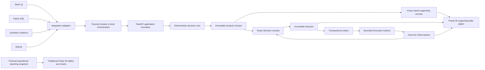

# Supply Response

## Email-to-case increment — deployed and live-verified

Implemented: review the discovered email and its delivery facts, explicitly
create its case, then use the existing Analyze disruption action. The case keeps
the actual sender, subject and stable mailbox-scoped message identity. Repeated
creation returns the same case; changed or ambiguous source content blocks.
Revision 33, source `974d4a1`, is live. Alex's browser created a case from Will's
0914-A email and completed live analysis using that exact message. The Outlook
citation opened it correctly; repeated creation reopened the identical case and
analysis. No mail was sent or Finance decision performed. 360 web tests and
661 backend tests passed (18 live-setting skips). See the
[release evidence](docs/reviews/2026-09-14-email-to-case-release.md).

## Earlier inbox-check increment — September 14, 2026

**Deployed and live-verified:** revision32, source `736c339`. Work IQ found the
presenter's newly sent `Demo run 0914-A` email in Alex's mailbox and retrieved
the revised FYI body (8,000 affected; 3,000 partial at $7.50 extra; 5,000 unknown).

The new **Check email for disruptions** action searches Alex's mailbox through
Work IQ for the presenter's Supplier Alpha email from `will@willmacdonald.com`
to `agent@willmacdonald.com`. It displays the actual subject, received time,
bounded message preview and validated Outlook link. Checks are read-only and
presenter-controlled; old saved cases remain collapsed and recoverable.

This increment does **not** yet create a case from the discovered email. That
requires message-bound case creation and duplicate prevention; opening a saved
case is not a substitute. Deployment and live-email acceptance are recorded in
[the inbox-check plan](docs/superpowers/plans/2026-09-14-inbox-check.md).

Supply Response is a decision-support demonstration for managing a fictional supplier disruption from detection through analysis, human approval, bounded execution, and outcome observation.

The project combines a deterministic supply-response core with a FastAPI application, a React decision console, durable SQLite or Fabric SQL persistence, and a Power BI project. Microsoft 365 and Azure integrations are added through explicit adapters so the complete live demonstration can use Work IQ, Microsoft Fabric, Microsoft Foundry, Microsoft Agent Framework, Entra ID, and Power BI without coupling the business logic to those services.

> **Deployed September 13, 2026:** [Open the demo](https://ca-sr-demo.orangehill-337f5d48.eastus2.azurecontainerapps.io/). Revision **ca-sr-demo--0000029**, source `afbf8db`, adds five stages and independent Alex/Taylor approval screens. Real Alex sign-in, fresh case creation, live analysis and a $24,750 Finance submission passed. Taylor's password sign-in is the remaining blocker to real rejection/approval/finalization acceptance. See the [approval release evidence](docs/reviews/2026-09-13-approval-browser-release.md).

> **Not yet a completed end-to-end live demo:** New cases require independent Taylor review for spending above $20,000, followed by Alex's separate final approval. Historical cases keep their original standing-authorization policy. Taylor's workflow is implemented and deployed but not yet accepted in her real browser session. Execution and email are explicitly unavailable for independent-approval cases. Teams handoff remains a separate open issue. See the [roadmap](docs/ROADMAP.md).

> **Verification boundary:** Local browser proof demonstrates rejection, resubmission, Finance approval and Alex's separate final approval with explicitly simulated API responses; it is not live-account acceptance. Current checks: 346 web tests plus production build; 561 backend/API/deployment tests (11 skips). The additive live database upgrade preserved existing cases, analyses and decisions. The existing traditional Power BI reporting release is unchanged; see its [release evidence](docs/reviews/2026-09-12-traditional-reporting-verification.md).

## Presenting the comparison

Reopen a known analyzed case for a repeatable walkthrough; create a showcase case
when deliberately demonstrating a fresh case and analysis. Reopening saved work
does not retrieve sources again or approve a response.

- **Explore in Power BI** starts a traditional investigation across 178 fictional
  operational records: inventory, deliveries, transfers, qualification, production
  demand and customer orders. The presenter uses rows, charts and filters to reason
  through the disruption.
- **Review with AI assistance** organizes the case into **Understand the disruption**,
  **Investigate responses**, and **Make the decision**. Authoritative calculations
  and recommendation ranking remain deterministic.
- **A card's supporting-data link** opens the exact saved records used by that
  analysis—not the broad dataset or an unrelated case count. The inventory view
  reconciles 4,500 on hand − 200 held − 300 protected = 4,000 available components.

Follow the [traditional-versus-assisted presenter walkthrough](docs/demo/traditional-and-assisted-walkthrough.md).
Real services host fictional data. A saved snapshot, successful source check or
working citation is not proof of a fresh retrieval during the presentation.

## What the demo shows

The canonical `RL-001` Demo Template targets the following closed-loop story.
The downstream steps are implemented locally but are not all accepted in the live tenant:

1. **Detect** — retrieve and structure a fictional supplier signal with source evidence.
2. **Analyze** — calculate inventory, production, customer, revenue, margin, and OTIF exposure deterministically.
3. **Decide** — compare feasible Response Options, recommend one using thresholded lexicographic ranking, and let Alex Morgan approve or reject it.
4. **Execute** — preserve the immutable Decision, create five bounded Execution Actions, and explicitly start visibly labeled Simulated Execution.
5. **Observe** — append Simulated Observations and compare predicted and observed results in the web console and, in live mode, Power BI.

Business personas, suppliers, communications, orders and outcomes are fictional.
Canonical scenario identities use `RL-`; the wider reporting context also uses
explicitly fictional `RPT-` identities.

## Architecture



The Decision is the immutable pivot between analysis and downstream activity. Authoritative calculations, feasibility, ranking, and approval policy remain in deterministic services rather than an LLM or agent.

## Implemented capabilities

- Canonical domain contracts for Case Instances, Evidence Items, Analysis Versions, Response Options, Decisions, Execution Actions, attempts, and Outcome Observations.
- Deterministic `RL-001` data, exposure calculations, option evaluation, Approval Satisfaction, and thresholded lexicographic ranking.
- Integrated validation for all ten focused `RL-EVAL-*` cases.
- Append-only, idempotent Decisions and transactional outbox processing.
- Exactly five bounded Execution Actions with durable attempt history.
- Explicit, idempotent Simulated Execution with permanently labeled observations.
- Presenter-focused React workspace with five stage tabs, source links/icons, bottom-of-card provenance, whole-dollar USD totals, two-decimal unit prices and an accessible recommendation explanation sheet.
- Durable fallback persistence through SQLite and a complete browser end-to-end gate.
- Opt-in Fabric SQL persistence, Entra token authentication, schema health checks, and read-only analytics views.
- Guarded, insert-only canonical RL-001 source loading with full stored-data readback and timezone-preserving SQL binding. Live retrieval freshness is separate from fictional business dates, so the corpus does not require daily regeneration. See the [loader procedure](docs/deployment/personal-tenant.md#load-the-canonical-rl-001-operational-source).
- A published DirectQuery Power BI project with seven broad traditional pages and eight exact saved-context pages. The isolated reporting dataset contains 178 records without changing saved analyses or the canonical operational source. Native tables/charts/filter checks, current/older saved inventory and order parity, and mismatched-identity safeguards passed. Artifact-bound acceptance enables the website links; populated execution outcomes remain unverified.
- Single-tenant Entra authentication with exact Alex/Taylor identity and role bindings. Authenticated Finance inbox/detail and approve/reject routes are deployed. Alex's real session passed; Taylor's interactive acceptance awaits password sign-in. No replacement identity or new permission was created.
- A delegated Work IQ OBO client and bounded MCP integration with strict source-statement validation. A narrow email query and named Team/channel lookup through Work IQ entity tools are followed by individual message reads. This is structured discovery, not Copilot semantic search. Microsoft Graph backs Work IQ resource paths; the application has no direct Graph client. Configured message IDs remain validation checks, never lookup inputs or fallback fetch targets. Prior live analysis verified both sources and the user opened the intended messages; the later Teams handoff/authentication-loop report remains unresolved. The September 12 UX release reopened saved evidence and did not repeat discovery.
- Microsoft Agent Framework orchestration that preserves deterministic decision authority, plus fail-closed Foundry publication and verification tooling.
- Three immutable Foundry prompt agents—signal, context, and decision—published as version `1` and verified against their committed contracts on `gpt-5.6-luna`.
- Personal-tenant Azure infrastructure deployed in East US 2 through the guarded workflow. Revision29 is healthy with unchanged reporting activation, resource-scoped roles and scale. This release created one fresh live approval-verification case and analysis, and submitted its response for Taylor; no operational action or email was executed.

Live Microsoft service integration is not yet complete. Published or configured cloud prerequisites do not count as live acceptance until their approval-gated invocation, data, browser, and cross-service consistency gates pass. The [roadmap](docs/ROADMAP.md) records the verified boundary between implemented, configured, and pending work.

## Runtime modes

Each Case Instance has exactly one immutable runtime mode. State never merges implicitly between modes.

| Mode | Purpose | Persistence | Integrations |
|---|---|---|---|
| `fallback` | Local development, automated tests, rehearsals, and cloud-outage recovery | SQLite | Synthetic evidence and local orchestration; Power BI unavailable |
| `live` | Final demonstration acceptance | Fabric SQL | Entra ID, Work IQ, Fabric, Foundry Agent Service, Microsoft Agent Framework, and Power BI |

Fallback mode is always explicit and never counts as proof that a live integration passed. Business data remains fictional in both modes.

## Repository layout

```text
supply-response/
├── apps/
│   ├── api/                 # FastAPI application and HTTP contracts
│   └── web/                 # React/Vite decision console
├── data/
│   ├── domain/              # Canonical domain models
│   ├── schemas/             # Portable source-data schemas
│   └── synthetic/           # Deterministic Demo Corpus generation
├── services/
│   ├── analysis/            # Exposure, options, ranking, and analysis
│   ├── decisions/           # Decision and outbox application services
│   ├── execution/           # Action planning, workers, and playback
│   ├── persistence/         # SQLite/Fabric persistence contracts
│   └── policy/              # Evidence, approval, and threshold policies
├── integrations/fabric/     # Fabric configuration, schema, and health
├── fabric/
│   ├── sql/                 # Operational schema and analytics views
│   └── power-bi/            # Power BI Project (PBIP)
├── evaluations/             # Focused cases and frozen expected results
├── tests/                   # Unit, contract, integration, and live gates
├── docs/                    # Architecture, ADRs, specs, plans, and roadmap
└── scripts/                 # Local verification entry points
```

## Local development

### Prerequisites

- Python 3.12
- [uv](https://docs.astral.sh/uv/)
- Node.js 20+ and npm
- Chromium installed through Playwright for browser tests
- ODBC Driver 18 for SQL Server only when using live Fabric SQL

### Install

From the repository root:

```bash
uv sync --python 3.12
npm --prefix apps/web ci
(cd apps/web && npx playwright install chromium)
```

### Run the fallback application

Start the API:

```bash
export SUPPLY_RESPONSE_RUNTIME_MODE=fallback
export SUPPLY_RESPONSE_DATABASE_URL=sqlite:///./supply-response.db
uv run --python 3.12 uvicorn apps.api.app.main:app --reload
```

In another terminal, start the web console:

```bash
npm --prefix apps/web run dev
```

Open `http://localhost:5173`. The API is available at `http://localhost:8000`, with OpenAPI documentation at `http://localhost:8000/docs`.

### Verify the fallback journey

After installing the dependencies and Playwright Chromium, run:

```bash
scripts/run_fallback_demo.sh
```

This gate runs the Python suite, Vitest suite, production web build, and real-browser fallback tests against a fresh temporary SQLite database. It does not require or contact Microsoft cloud services.

Individual checks are also available:

```bash
uv run --python 3.12 pytest -q
npm --prefix apps/web test
npm --prefix apps/web run build
```

## Live integration safety

Live mode fails closed when configuration, identity, connectivity, or schema validation is incomplete; it never silently falls back to SQLite. Tenant IDs, Entra object IDs, UPNs, workspace IDs, database endpoints, and other deployment bindings must remain in environment-specific configuration rather than committed source.

Cloud deployment and live tests are intentionally approval-gated because they authenticate to external services and may create or modify tenant resources. Deployment guidance, verified cloud evidence, remaining bindings, and required settings are recorded in [the personal-tenant deployment plan](.azure/deployment-plan.md), the implementation plan, and the task reports under `.superpowers/sdd/`.

## Project documentation

- [Frozen demo contract](docs/superpowers/specs/2026-08-30-supply-response-demo-contract-design.md) — controlling product scope and acceptance criteria
- [Original implementation plan](docs/superpowers/plans/2026-08-30-supply-response-demo-implementation.md) — Tasks 0–19
- [Approved traditional reporting correction](docs/superpowers/specs/2026-09-12-traditional-operational-reporting-design.md) — traditional investigation versus exact supporting-data links
- [Presenter header and planning tabs](docs/superpowers/specs/2026-09-12-presenter-header-and-stage-tabs-design.md)
- [Recommendation explanation sheet](docs/superpowers/specs/2026-09-12-recommendation-explanation-sheet-design.md)
- [Roadmap and current status](docs/ROADMAP.md)
- [Canonical domain language](CONTEXT.md)
- [Architecture decisions](docs/adr/)
- [Portable-core architecture](docs/architecture/portable-core.md)
- [Current acceptance traceability](docs/current-baseline-and-acceptance-traceability.md)
- [Original project brief](Supply-Response-Project-Brief.md) — product vision; the frozen contract controls when they differ

## Scope boundaries

The project does not send supplier communications, modify purchase orders, make financial or contractual commitments, use real business data, or permit an agent to perform authoritative arithmetic. Fabric IQ is optional for the core demonstration. Foundry IQ retrieval of SOPs, policies, supplier-risk documents, and continuity playbooks remains a separately designed backlog item.
