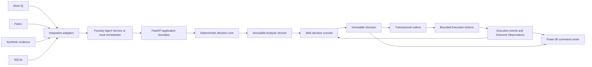

# Supply Response Demo Contract Design

**Date:** 2026-08-30
**Status:** Frozen
**Baseline commit:** `302a9ea`
**Approach:** Contract-first, adapter-backed milestones

## Purpose

This specification freezes the intended Supply Response demonstration as a complete product contract while dividing delivery into independently verifiable milestones. It preserves the tested portable decision core, adds real Microsoft integrations through stable adapters, and extends the demonstration from detection and analysis through human decision, bounded execution, and outcomes.

This document resolves the ambiguities identified in:

- `docs/codebase-recon-current.md`
- `docs/current-baseline-and-acceptance-traceability.md`
- `Supply-Response-Project-Brief.md`

When this specification differs from the original brief, this specification controls implementation scope, acceptance interpretation, terminology, and timing. The original brief remains the product-vision source. Canonical domain language is defined in `CONTEXT.md`.

## Baseline

The current repository is a tested portable decision-calculation core. It has deterministic synthetic data, baseline exposure calculations, Response Option construction, API approval and rejection routes, and an in-memory ledger. It does not yet have live Work IQ or Fabric integrations, Foundry-hosted orchestration, durable persistence, an operational web console, a Power BI implementation, integrated Response Option evaluation and ranking, bounded execution, or browser end-to-end coverage.

The existing implementation is the starting point. The design does not replace it with either GitHub donor branch. Current fixtures and code intentionally differ from the frozen RL-001 contract in this document; reconciling those differences is Milestone 2 work.

## Goals

The completed demonstration shall:

1. Detect and structure a supplier disruption without inventing facts.
2. Retrieve current collaboration evidence through Work IQ.
3. Retrieve governed operational data and persist shared state through Fabric.
4. Calculate supply, production, customer, revenue, margin, and OTIF exposure deterministically.
5. Compare feasible Response Options and recommend one through an auditable thresholded lexicographic policy.
6. Show evidence, assumptions, constraints, and approval requirements for every Response Option.
7. Allow Alex to approve or reject the response in a web decision console.
8. Preserve the Decision in an immutable, durable ledger.
9. Use the Decision as the reference point for bounded Execution Actions and Outcome Observations.
10. Show the selected Response Option, execution state, and outcomes in both the web console and Power BI.
11. Provide a deterministic, visibly labeled fallback mode without presenting it as live-integration success.
12. Demonstrate real Microsoft authentication and live service calls over a completely fictional Demo Corpus.

## Non-goals

- Sending a supplier communication outside the demo environment.
- Creating or modifying a purchase order.
- Making a financial or contractual commitment.
- Allowing an LLM or agent to perform authoritative arithmetic.
- Silently switching between live and fallback data.
- Using personal, real customer, real supplier, or production business data in the Demo Corpus.
- Requiring Fabric IQ for the core demonstration.
- Implementing Foundry IQ in the active milestones.
- Requiring Power BI in fallback mode.
- Turning all ten focused evaluation cases into polished narrative demos.
- Generalizing the prototype into an enterprise-wide supply-chain platform.

## Scope Model

The specification has two levels:

- A complete end-state demo contract.
- Cumulative milestone exit gates that can be verified independently.

A milestone can satisfy individual acceptance criteria. Only the final hardening milestone can claim the complete demo contract.

The demonstration uses one canonical `RL-001` Demo Template. Every automated run, rehearsal, or showcase creates a new immutable Case Instance with its own Case ID and one of these purposes:

- `automated_test`
- `rehearsal`
- `showcase`

Case Instances are never reset or overwritten. The ten `RL-EVAL-*` cases remain focused validation cases rather than alternate narrative demonstrations.

## Required and Optional Microsoft Capabilities

- Work IQ is required for final live-demo acceptance.
- Fabric is required for final live-demo acceptance.
- Power BI is required as the live operational command-center surface.
- Foundry Agent Service and Microsoft Agent Framework are required for final live-mode orchestration.
- Fabric IQ remains conditional on a separate go/no-go decision and cannot block the core demo.
- Foundry IQ is a backlog item and does not affect active acceptance.

Foundry Agent Service is not Foundry IQ. Requiring Foundry-hosted agents does not bring SOP, policy, supplier-risk, or playbook retrieval into active scope.

## Architecture Decision Records

- [ADR 0001: Isolate runtime provenance by Case Instance](../../adr/0001-isolate-runtime-provenance-by-case.md)
- [ADR 0002: Preserve Decisions and create downstream work through a transactional outbox](../../adr/0002-immutable-decisions-with-transactional-outbox.md)
- [ADR 0003: Keep decision authority deterministic and use thresholded lexicographic ranking](../../adr/0003-use-deterministic-thresholded-lexicographic-ranking.md)
- [ADR 0004: Map portable Demo Personas to tenant identities](../../adr/0004-map-portable-demo-personas-to-tenant-identities.md)

## Runtime Modes and Provenance

The application has exactly two explicit runtime modes. Runtime mode is immutable for a Case Instance. Switching modes creates a new Case Instance; state never merges implicitly.

### Live mode

- Real Entra authentication is used against purpose-built fictional demo accounts.
- Work IQ is authoritative for the existence, author, timestamp, and content of supplier and collaboration statements in the Demo Corpus.
- Fabric is authoritative for operational data and durable case, Decision, Execution Action, and Outcome Observation state.
- Foundry Agent Service and Microsoft Agent Framework run the approved orchestration.
- Power BI reads Fabric state.
- Passing live mode is required for final demo acceptance.
- Business data and business outcomes remain fictional and visibly labeled even though the integrations are live.

### Fallback mode

- Synthetic evidence replaces Work IQ retrieval.
- SQLite stores the operational snapshot and durable local case, Decision, Execution Action, and Outcome Observation state.
- Local orchestration substitutes for Foundry-hosted orchestration while preserving contracts.
- The web console displays a persistent `Fallback mode` indicator.
- Mode provenance appears in API responses and persisted records.
- Fallback supports development, automated tests, rehearsal, and recovery from cloud unavailability.
- Power BI is explicitly unavailable because its authoritative source is Fabric.
- Fallback never starts automatically and never counts as passing the live-integration gate.

### Scenario time and retrieval time

The canonical RL-001 Scenario Effective Time is:

```text
2026-09-01T09:00:00-05:00[America/Chicago]
```

Every September business date belongs to this visibly labeled fictional timeline, regardless of the presentation date. Evidence retains separate source, retrieval, effective, and expiry timestamps.

- Retrieval freshness uses wall-clock time and proves that a live source was called during the current analysis.
- Business validity is evaluated against Scenario Effective Time and explicit effective or expiry dates.
- Demo data does not need to be regenerated within 24 hours of a presentation.
- Production use would substitute the real analysis time for Scenario Effective Time.

## Architecture



The approved Decision is the immutable pivot between analysis and downstream activity. Execution Actions and Outcome Observations reference the Decision; they never overwrite or absorb it.

## Component Responsibilities

### Integration adapters

Adapters normalize live and fallback sources into identical domain contracts.

- A Work IQ adapter retrieves supplier communications and internal Quality collaboration evidence with citations.
- A Fabric adapter retrieves operational data and persists shared durable state.
- A synthetic-evidence adapter provides deterministic cited fixtures.
- A SQLite adapter provides local durable state.

Each adapter reports runtime mode, source identity, source timestamp, retrieval timestamp, effective time, provenance, and health.

### Agent orchestration

The live path uses Foundry Agent Service and Microsoft Agent Framework.

- The Signal Agent retrieves supplier communications and structures explicit facts, uncertainties, conflicts, and citations.
- The Context Agent retrieves current Teams and email collaboration evidence, Quality ownership, qualification, and commitments.
- The Decision Agent calls deterministic tools and explains their typed results.
- The Orchestrator controls workflow state, tool sequencing, evidence lineage, and approval boundaries.

Agents may retrieve, normalize, summarize, and explain. They may not perform authoritative exposure calculations, determine feasibility without deterministic policy evaluation, resolve Evidence Conflicts, or mutate a Decision.

Active Work IQ scope excludes curated SOPs, formal policies, supplier-risk documents, and continuity playbooks. Those remain part of the Foundry IQ backlog.

### Deterministic decision core

The core owns inventory availability, time-phased projection, exposure, Response Option outcomes, feasibility gates, thresholded ranking, Approval Satisfaction evaluation, recommendation construction, and Analysis Version invalidation.

### API boundary

FastAPI is the only application boundary used by the browser. It exposes runtime health, Case Instances, Evidence Items, Analysis Versions, Response Options, Decisions, Execution Actions, drafts, Simulated Execution controls, and Outcome Observations.

Mode selection is server configuration. The browser cannot select an arbitrary database or combine live and fallback sources.

### User surfaces

The React web decision console is one progressive Case workspace used by Alex to investigate a case, compare Response Options, approve or reject a response, and monitor downstream execution and outcomes.

Its sections are:

1. Case header with mode, Scenario Effective Time, integration health, and status.
2. Supplier signal and cited Evidence Items.
3. Exposure and operational lineage.
4. Response Option comparison and recommendation.
5. Decision confirmation and immutable Decision receipt.
6. Execution Actions and Outcome Observations.
7. A live-mode link to the Power BI command center.

Power BI is the live operational command center across cases. It contains two required pages:

1. **Command Center:** active disruptions, severity, Decision status, revenue and OTIF exposure, and time since signal.
2. **Actions and Outcomes:** selected Response Options, Execution Actions, predicted results, simulated observations, variance, Scenario Effective Time, and projection refresh time.

Power BI defaults to the latest `showcase` Case Instance. Explicit filters may include prior showcase, rehearsal, or automated-test cases.

## Identity and Persona Contract

All named people in the business story are fictional Demo Personas represented by purpose-built tenant accounts.

| Stable persona ID | Name | Effective application roles | Product-license requirement |
|---|---|---|---|
| `RL-PERSONA-ALEX` | Alex Morgan | `material_planner`, `response_approver` | Required services for Alex's live demo interactions |
| `RL-PERSONA-JORDAN` | Jordan Lee | `quality_approver` | Teams access required for the live Quality collaboration artifact |
| `RL-PERSONA-TAYLOR` | Taylor Brooks | `finance_approver` | No Microsoft 365 product license required for the approved app-only flow |

Each deployment maps stable persona IDs to tenant ID (`tid`), Entra object ID (`oid`), UPN, and required app roles or direct role assignments.

Authorization uses `tid`, `oid`, and app-role or direct group claims, never UPN alone. Real tenant bindings stay in deployment configuration and are not committed. A Decision captures the stable persona ID plus an immutable identity snapshot of tenant ID, object ID, UPN, display name, and effective application roles.

The Supply Response app registration and enterprise application do not exist in the current baseline. Role definition and assignment are implementation work. Taylor may be created without a product license now; the `finance_approver` assignment and one-time app interaction occur only after the application exists.

## Evidence Contract

Every Evidence Item includes:

- Stable Evidence ID and Case ID.
- Evidence kind: `operational_fact`, `source_statement`, `prerequisite_approval`, or `contextual_evidence`.
- Field-specific Authority Scope.
- Source kind, identity, and reference.
- Source, retrieval, effective, and expiry timestamps as applicable.
- Runtime mode, source system, and live or synthetic provenance.
- Human-readable claim or extract.
- Citation or deep link.
- Freshness and business-validity states.
- Any detected conflict or uncertainty.

Synthetic/live provenance is independent of authority. A fallback operational fixture can be authoritative within a fallback case while remaining permanently synthetic.

Authority is field-specific:

- Fabric or SQLite operational records establish operational quantities, orders, dates, and qualification state within their mode.
- Work IQ establishes that a statement exists, who made it, when, and what it said; a communication does not override an operational record merely because it is newer.
- A server-owned Approval Satisfaction establishes prerequisite status for one Analysis Version and Response Option.
- Contextual evidence informs explanation but cannot independently satisfy a feasibility or approval gate.

A feasibility-relevant Evidence Conflict remains unresolved until the authoritative record is corrected or refreshed, the source owner supplies newer authoritative evidence, or an authorized human creates a typed Conflict Resolution. Agents may detect and explain conflicts but never resolve them. The Conflict Resolution joins the Analysis Version lineage.

Every required Work IQ Evidence Item in the canonical live demo must include a stable source reference, source and retrieval timestamps, a human-readable excerpt, and a navigable citation or deep link to the fictional M365 item. Missing required citations fail live acceptance.

## Freshness and Analysis Invalidation

Freshness is policy-versioned by evidence semantics rather than one universal wall-clock age.

- Operational retrieval must succeed during the current analysis and meet the adapter's retrieval-health threshold.
- Supplier and internal commitments are valid relative to Scenario Effective Time and explicit effective or expiry dates.
- Quality qualification is governed by explicit effective, expiry, revocation, and approval state.
- Missing required source timestamps are stale.
- A Prerequisite Approval or Approval Satisfaction is valid only for its stated scope and conditions.

An Analysis Version becomes stale when evidence content or Authority Scope, required evidence validity, operational quantities or dates, feasibility or comparator values, required approvals, or calculation/ranking/policy versions materially change. Display-only metadata and retrieval retries returning identical normalized content do not invalidate it.

## Feasibility and Thresholded Lexicographic Ranking

Feasibility is a hard gate. A Response Option is not executable when any required operational input, inventory quantity, timing condition, qualification, approval prerequisite, evidence requirement, or policy constraint fails.

Supplier Beta is not executable because its authoritative Quality qualification is `pending`; its audit and first-article requirements are incomplete. A retrieved but unresolved constraint cannot be treated as satisfied.

The No-Mitigation Baseline is always calculated for comparison. It does not count as a Feasible Mitigation and is not recommendable when policy requires an active response.

Executable Response Options are ranked through deterministic thresholded lexicographic elimination. For each comparator, the core finds the best value among remaining options, retains every option within that comparator's threshold of the best, and evaluates only those retained options on the next comparator.

| Order | Comparator | Materiality threshold |
|---:|---|---:|
| 1 | Uncovered Constrained-Part Demand | 500 component units |
| 2 | Projected OTIF Loss Percentage | 10 percentage points |
| 3 | Revenue at risk | USD $50,000 |
| 4 | Margin at risk | USD $25,000 |
| 5 | Response cost | USD $10,000 |
| 6 | Approval burden | Exact integer |
| 7 | Execution risk | Exact integer |
| 8 | Stable Response Option ID | Exact lexical order |

Uncovered Constrained-Part Demand uses disrupted-component units. Projected OTIF Loss Percentage uses the fixed affected customer-order-line set as its denominator. Monetary values are explicit USD values. The Analysis Horizon extends through the latest affected production or customer due date.

Approval burden counts distinct Prerequisite Approval roles and excludes the universal final Response Approver role. Execution-risk factors are versioned deterministic outputs: add `2` for each unconfirmed external supply or recovery commitment, `1` for a cross-plant movement, `1` for a production-schedule change, and `1` for each coordinated action after the first.

The API returns raw comparator values, thresholds, retained/eliminated status at each stage, and triggered risk factors. If no Response Option is feasible, the system produces an escalation package with all blocking reasons and required human decisions.

## Canonical RL-001 Contract

### Fixed operational facts

- Chicago has 4,000 usable MAT-10247 component units.
- Dallas has 1,500 usable MAT-10247 units; its 300 protected units remain unavailable.
- Two production orders require 5,000 and 5,800 component units.
- Their customer orders represent USD $375,000 revenue / $125,000 margin and USD $580,000 revenue / $203,000 margin.
- Priority `1` is highest. The $580,000 order is priority `1`; the $375,000 order is priority `3`.
- A customer-order line is protected only when its complete quantity remains deliverable on time. Partial production reduces uncovered demand but does not claim partial revenue, margin, or OTIF protection.
- Alpha's 3,000-unit September 6 air-freight offer is optional and excluded from the No-Mitigation Baseline.
- Accepting Alpha's expedite confirms 3,000 units for September 6 at USD $7.50 per unit.
- The Dallas transfer dispatches September 4, arrives before September 5 consumption, moves 1,500 usable units, and costs USD $1.50 per unit.
- The remaining 5,000-unit Alpha recovery date is unknown during analysis.
- Supplier Beta has an authoritative `pending` Quality qualification and no valid Approval Satisfaction.

### Predicted Response Option results

| Response | Executable | Uncovered part demand | OTIF loss | Revenue at risk | Margin at risk | Cost |
|---|---:|---:|---:|---:|---:|---:|
| No-Mitigation Baseline | Excluded | 6,800 | 100% | $955,000 | $328,000 | $0 |
| Expedite Alpha partial | Yes | 3,800 | 100% | $955,000 | $328,000 | $22,500 |
| Transfer from Dallas | Yes | 5,300 | 50% | $580,000 | $203,000 | $2,250 |
| Resequence production | Yes | 6,800 | 100% | $955,000 | $328,000 | $0 |
| Supplier Beta | No | Not calculated | Not calculated | Not calculated | Not calculated | Not calculated |
| Combined response | Yes | 2,300 | 50% | $375,000 | $125,000 | $24,750 |

The combined response protects the priority order representing USD $580,000 revenue and $203,000 margin. It ranks first because its 2,300 uncovered component units materially outperform the next-best 3,800 units at the first comparator. The stable ID never determines the canonical winner.

At least three genuine mitigations must be feasible for RL-001. Other evaluation cases may correctly return fewer or none.

### Approval policy

The Finance-approval threshold is USD $20,000.

Taylor's Standing Authorization permits expedite and combined Response Options, total response cost up to USD $25,000, Demo Corpus Case Instances only, and validity from Scenario Day 0 through Day 14. It permits no external sending, purchase-order changes, or financial commitments.

The server creates an analysis-bound Approval Satisfaction only when every condition matches. Taylor's app-role assignment alone is not approval evidence.

Alex legitimately holds Material Planner and Response Approver roles. One approval interaction atomically records Alex's Material Planner Approval Satisfaction and final Decision, with both roles in the identity snapshot. Alex cannot satisfy Finance or Quality prerequisites.

## Decision and Ledger Contract

The Decision ledger is append-only and durable. A Decision includes:

- Decision ID and Case ID.
- Analysis Version and calculation/policy versions.
- Actor persona and tenant identity snapshot.
- Effective roles and Approval Satisfaction records.
- Approval or rejection.
- Complete selected Response Option snapshot for an approval.
- Evidence IDs, assumptions, constraints, comparator trace, and source lineage.
- Runtime mode and Scenario Effective Time.
- Idempotency key and timestamp.

An accepted retry returns the existing Decision and cannot create a second logical Decision.

A rejection appends an immutable Decision, creates no Execution Actions or Outcome Observations, and leaves the case eligible for reanalysis. A later approval is a new Decision; it never overwrites the rejection.

A material change after approval preserves the historical Decision, marks the case `reanalysis_required`, and creates a new Analysis Version. A later approved Decision becomes the Current Decision for future activity. Existing Execution Actions remain linked to their originating Decision and are cancelled or reconciled explicitly rather than moved.

## Bounded Execution Contract

Approval uses a transactional outbox. The approval transaction atomically appends the immutable Decision and an `ActionPlanningRequested` outbox event keyed to that Decision. Approval succeeds when both are durable.

An idempotent worker creates Execution Actions within 15 seconds. Planning failure never rolls back the Decision. The UI shows `Approved — action planning failed` and exposes a safe retry.

For the combined response, the worker creates exactly these actions:

| Action | Owner | Completion criterion |
|---|---|---|
| Prepare Alpha recovery-request draft | Alex | Unsent draft is ready |
| Coordinate Alpha expedited partial | Alex | Simulated 2,800-unit receipt is recorded |
| Transfer 1,500 units Dallas to Chicago | Alex | Simulated Chicago receipt is recorded |
| Resequence production to the priority order | Alex | Revised sequence is recorded |
| Update disruption status | System | Case reaches `monitoring` |

No Beta Execution Action is created because Beta was not selected. Its September 15 review date remains Quality evidence on the fictional scenario timeline, not a real-calendar task.

Execution Actions have a mutable current-state projection backed by append-only status and Execution Attempt events:

```text
planned → in_progress → completed
                 ↘ failed → retry attempt → in_progress
planned or in_progress → cancelled
```

Completion means the bounded internal artifact or simulated task reached its declared criterion. It never proves that an external supplier or operational system acted.

## Simulated Execution and Outcome Contract

After actions appear, Alex selects **Start simulated execution**. The control is available only for the Demo Corpus and displays a permanent simulation banner.

Playback runs deterministically for 45–60 seconds, operates only on actions belonging to the recorded Decision ID, is idempotent by Decision ID, returns the existing playback if invoked again, and requires a new Case Instance to replay from the beginning. Separate evaluation cases cover failure and retry demonstrations.

Outcome Observations are append-only child records linked to a Decision and, where applicable, an Execution Action. They include Observation kind (`actual` or `simulated`), metric, value, unit, predicted baseline, Scenario Effective Time, wall-clock recorded time, source reference, and permanent synthetic indicator.

Canonical RL-001 produces only Simulated Observations:

| Observation | Predicted | Simulated observed |
|---|---:|---:|
| Alpha expedited quantity | 3,000 | 2,800 |
| Dallas transfer quantity | 1,500 | 1,500 |
| Total response-arranged supply | 4,500 | 4,300 |
| Uncovered part demand | 2,300 | 2,500 |
| Response cost | $24,750 | $25,000 |
| Protected customer orders | 1 | 1 |
| Revenue protected | $580,000 | $580,000 |
| Margin protected | $203,000 | $203,000 |
| OTIF loss | 50% | 50% |
| Remaining Alpha recovery date | Unknown | September 12 |

The controlled variance demonstrates outcome tracking without changing the protected customer result or exceeding Taylor's cap. Power BI and the web console use `Simulated`, never `Actual`, for these values.

## Disruption Case Lifecycle

```text
open
→ analyzing
→ awaiting_decision
→ action_planning
→ executing
→ monitoring
→ closed
```

Rejection moves the case to `decision_rejected`, which remains eligible for reanalysis. A material change moves it to `reanalysis_required`. Successful reanalysis returns it to `awaiting_decision`. Action-planning failure leaves it in `action_planning` with a failed attempt and retry control. Decision and Execution Action states remain separate.

## End-to-End Data Flow

1. A supplier communication starts a new Case Instance from RL-001.
2. Work IQ returns source content and citations; the Signal Agent extracts facts and uncertainty.
3. The Context Agent retrieves Quality and collaboration evidence.
4. Fabric returns the operational snapshot.
5. The deterministic core calculates baseline exposure, Response Option outcomes, feasibility, and ranking.
6. The immutable Analysis Version and evidence bundle are persisted.
7. The web console displays the fixed Analysis Version to Alex.
8. Approval or rejection is validated against identity, roles, policy, and Approval Satisfaction.
9. Approval atomically appends the Decision and outbox event.
10. The worker creates the five Execution Actions.
11. Alex starts visibly labeled Simulated Execution.
12. Execution events and Simulated Observations are appended.
13. The web and Power BI models reflect the Decision, actions, predicted values, simulated observations, variance, and timestamps.

## Failure Handling

### Integration availability

Live-source failure is visible and blocks live acceptance. Switching to fallback requires explicit operator action and creates a new fallback Case Instance.

### Evidence and data quality

Missing, stale, contradictory, or uncited evidence remains visible. Missing required evidence, an unresolved feasibility-relevant conflict, or incomplete Fabric data blocks authoritative analysis or approval.

### Concurrency and retries

- Stale Analysis Versions cannot be approved.
- Decision and outbox writes are atomic and idempotent.
- Action planning and Simulated Execution are independently idempotent by Decision ID.
- Retrying returns or advances existing records rather than duplicating them.
- Partial Execution Action failure is isolated to that child and its attempt history.

### Dashboard lag

Power BI refresh lag never changes ledger truth. Both surfaces display timestamps, and Power BI reports when its projection is behind the Decision ledger.

### Agent failure

Retrieved evidence and deterministic results remain intact. Agent explanations can be retried without recalculating or changing authoritative records.

## Verification Strategy

### Deterministic tests

- Exact RL-001 No-Mitigation and Response Option comparator bundles.
- Thresholded elimination trace and combined-response winner.
- Integrated feasibility, Approval Satisfaction, and recommendation rationale.
- All ten focused evaluation cases through real case analysis.

Current isolated helper tests must be promoted to integrated Analysis Version tests. The baseline's 3,800-unit No-Mitigation shortage, omitted transfer cost, random customer priority, and unintegrated Response Option outcomes are explicitly superseded by this contract.

### Adapter contract tests

- Work IQ and synthetic evidence produce equivalent Evidence Item contracts.
- Fabric and SQLite produce equivalent domain and persistence contracts.
- Runtime mode, timestamps, Authority Scope, citations, and lineage remain visible.
- Fallback never exposes Power BI as available.

### Persistence and API tests

- Restart survival and append-only history.
- Idempotent Decision, outbox, action planning, and playback.
- Stale-analysis rejection and concurrent update handling.
- Decision-to-action and Decision-to-outcome linkage.
- Rejection and supersession behavior.
- Blocked-response enforcement and partial execution retry behavior.

### Safety and privacy tests

- No action adapter can send externally, modify a purchase order, or make a financial commitment.
- Fixtures, records, drafts, and rendered content contain no real business data.
- Tenant bindings are deployment configuration, not committed values.
- Demo Personas and all synthetic or fallback content are visibly labeled.
- Simulated Observations can never render or aggregate as Actual Observations.

### Browser and live-integration tests

- Complete fallback browser journey through simulated outcomes.
- Live Work IQ retrieval with navigable citations to fictional supplier and Quality evidence.
- Live Fabric operational reads and durable writes.
- Foundry Agent Service and Microsoft Agent Framework orchestration.
- Entra persona-role enforcement for Alex, Jordan, and Taylor.
- Web console and Power BI display the same Decision ID and selected Response Option.
- Power BI defaults to the latest showcase case with simulation and refresh labels.

### Timing and rehearsal gates

- Live analysis completes within 90 seconds.
- The core operator workflow targets three minutes and has a five-minute hard limit.
- Simulated Execution completes in 45–60 seconds after explicit start.
- Full narration targets seven to ten minutes.
- Five consecutive live rehearsals satisfy the five-minute core-operator limit.
- Execution Actions appear within 15 seconds of approval.
- Power BI reflects the Decision within 60 seconds and displays its refresh timestamp.

Fallback tests prove resilience and parity. They do not satisfy final live-demo acceptance.

## Frozen Acceptance Criteria

1. Work IQ retrieves the fictional supplier communication with a navigable citation and extracts explicit facts without inference.
2. Fabric identifies affected operational entities from the live snapshot.
3. Calculations are deterministic, versioned, reproducible, and match frozen RL-001 values.
4. Work IQ retrieves Jordan's Beta Quality evidence with authority, validity, and citation metadata.
5. Beta remains non-executable while its qualification is `pending`.
6. RL-001 exposes at least three Feasible Mitigations; focused evaluation cases may expose fewer or none.
7. The frozen thresholded policy ranks the combined response first.
8. Every Response Option shows evidence, assumptions, constraints, Approval Satisfaction, comparator values, thresholds, and elimination trace.
9. Entra-authenticated Alex can approve or reject while Finance and Quality prerequisites remain separate.
10. Approval or rejection writes a durable, append-only, idempotent Decision with complete lineage.
11. Approval atomically writes the Decision and outbox event; the five Execution Actions appear within 15 seconds.
12. Explicitly started, idempotent Simulated Execution appends the frozen observations without external commitments.
13. The web console shows the Decision, actions, predictions, Simulated Observations, and variance.
14. Power BI's two pages reflect the same Fabric-backed state and display Scenario Effective Time and refresh time.
15. Runtime-mode provenance is immutable by case; fallback is explicit and excludes Power BI.
16. Foundry Agent Service and Microsoft Agent Framework run live orchestration while deterministic services retain authority.
17. Evidence conflicts, staleness, missing citations, and material changes block approval according to policy.
18. The Demo Corpus contains no real business data; persona bindings remain deployment configuration.
19. Live analysis completes within 90 seconds, five core workflows complete within five minutes, and narration completes in seven to ten minutes.
20. All ten focused evaluation cases pass through integrated analysis.

## Milestones

### Milestone 0: Baseline and specification freeze

Deliverables are the current-main recon, acceptance traceability, frozen specification, canonical glossary, and four ADRs.

Exit gate: this document, `CONTEXT.md`, and the four ADRs are committed together.

### Milestone 1: Portable core and domain alignment

Status: completed for baseline capabilities only. The frozen RL-001 changes are not claimed as implemented.

### Milestone 2: Decision-quality completion

- Correct No-Mitigation to exclude the optional Alpha partial.
- Freeze priorities and transfer inputs.
- Integrate transfer, resequencing, combined feasibility, outcomes, thresholds, ranking trace, evidence bundles, and rationale.
- Replace overloaded legacy entity names with the canonical model.

Exit gate: frozen RL-001 and all ten evaluation cases pass integrated analysis.

### Milestone 3: Durable closed-loop backend

- Persist Case Instances, Analysis Versions, Decisions, outbox events, Execution Actions, attempts, drafts, status events, and Outcome Observations in SQLite.
- Implement rejection, reanalysis, supersession, and idempotency.

Exit gate: restart, concurrency, lineage, and replay tests pass.

### Milestone 4: Web decision console

Deliver the progressive case workspace, Decision receipt, execution controls, and outcome views.

Exit gate: the fallback browser journey passes with explicit mode and simulation labeling; Power BI is unavailable.

### Milestone 5: Fabric and Power BI

Add Fabric adapters and the two Power BI pages.

Exit gate: the selected Response Option, Decision ID, actions, predictions, and simulated observations agree across live surfaces.

### Milestone 6: Work IQ, Foundry agents, identity, and execution

- Add cited Work IQ retrieval and Foundry Agent Service / Agent Framework orchestration.
- Register the Entra application, define roles, and bind the three Demo Personas per deployment.
- Implement Standing Authorization, Approval Satisfaction, outbox planning, and Simulated Execution.

Exit gate: live Beta evidence blocks correctly, Taylor satisfies Finance without a presentation-time interaction, and every action references its Decision.

### Milestone 7: Release and demo hardening

Complete privacy, parity, failure UX, timing gates, live rehearsals, fallback rehearsal, non-blocking scale tests, and the Fabric IQ go/no-go.

Exit gate: every frozen acceptance criterion passes.

## Non-blocking Scale Target

The original scale targets remain performance fixtures rather than correctness gates: 250 suppliers, 10,000 parts, 100,000 BOM relationships, multiple plants, 50,000 open customer-order lines, and twelve months of history.

## Backlog

### Optional Power BI expansion

Dedicated Exposure and Response Option Comparison pages may be added after the required pages. The web console remains authoritative for case-level investigation and interaction.

### Foundry IQ institutional knowledge

Foundry IQ remains deferred. A future increment may retrieve SOPs, Supply and Quality policies, supplier-risk assessments, and continuity playbooks through a permission-aware cited knowledge base. It requires a separate review of Azure AI Search, permissions, freshness, preview status, cost, typed constraint production, and fallback fixtures.

No Foundry IQ adapter, abstraction, infrastructure, or acceptance criterion is added before that backlog item is separately designed and approved.

## Final Demonstration Narrative

1. **Detect:** Work IQ retrieves and structures the fictional supplier signal with a live citation.
2. **Analyze:** Fabric and deterministic tools calculate exposure and the frozen Response Option comparison.
3. **Decide:** The system recommends the combined response and Alex records the immutable Decision.
4. **Execute:** The Decision creates five internal actions; Alex explicitly starts Simulated Execution.
5. **Observe:** Simulated Observations show supply, cost, customer, margin, and OTIF variance in the web console and Power BI.

Fallback rehearses the same story in the web console, but final acceptance requires live Work IQ, Fabric, Foundry Agent Service, Microsoft Agent Framework, Entra, and Power BI.
