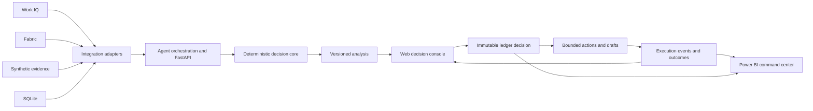

# Supply Response Demo Contract Design

**Date:** 2026-08-30  
**Status:** Approved interactively; pending final written review  
**Baseline commit:** `302a9ea`  
**Approach:** Contract-first, adapter-backed milestones

## Purpose

This specification freezes the intended Supply Response demonstration as a complete product contract while dividing delivery into independently verifiable milestones. It preserves the tested portable decision core, adds real Microsoft integrations through stable adapters, and extends the demonstration from detection and analysis through decision, bounded execution, and outcomes.

This document resolves the ambiguities identified in:

- `docs/codebase-recon-current.md`
- `docs/current-baseline-and-acceptance-traceability.md`
- `Supply-Response-Project-Brief.md`

When this specification differs from the original brief, this specification controls implementation scope, acceptance interpretation, and timing. The original brief remains the product-vision source.

## Baseline

The current repository is a tested portable decision-calculation core. It has deterministic synthetic data, exposure calculations, scenario construction, API approval and rejection routes, and an in-memory ledger. It does not yet have live Work IQ or Fabric integrations, durable persistence, an operational web console, a Power BI implementation, integrated recommendation ranking, bounded execution, or browser end-to-end coverage.

The existing implementation is the starting point. The design does not replace it with either GitHub donor branch.

## Goals

The completed demonstration shall:

1. Detect and structure a supplier disruption without inventing facts.
2. Retrieve current collaboration evidence through Work IQ.
3. Retrieve governed operational data and persist shared state through Fabric.
4. Calculate supply, production, customer, revenue, margin, and OTIF exposure deterministically.
5. Compare feasible response scenarios and recommend one through an auditable ordered policy.
6. Show evidence, assumptions, constraints, and approval requirements for every scenario.
7. Allow Alex to approve or reject the response in a web decision console.
8. Preserve the decision in an immutable, durable action ledger.
9. Use the ledger decision as the reference point for bounded execution and outcome records.
10. Show the selected action, execution state, and outcomes in both the web console and Power BI.
11. Provide a deterministic, visibly labeled fallback mode without presenting it as live-integration success.

## Non-goals

- Sending a supplier communication outside the demo environment.
- Creating or modifying a purchase order.
- Making a financial or contractual commitment.
- Allowing an LLM or agent to perform authoritative arithmetic.
- Silently switching between live and fallback data.
- Requiring Fabric IQ for the core demonstration.
- Implementing Foundry IQ in the active milestones.
- Generalizing the prototype into an enterprise-wide supply-chain platform.

## Decisions

### Scope model

The specification has two levels:

- A complete end-state demo contract.
- Cumulative milestone exit gates that can be verified independently.

A milestone can satisfy individual acceptance criteria. Only the final hardening milestone can claim the complete demo contract.

### Required and optional Microsoft capabilities

- Work IQ is required for final live-demo acceptance.
- Fabric is required for final live-demo acceptance.
- Power BI is required as the operational command-center surface.
- Fabric IQ remains conditional on a separate go/no-go decision and cannot block the core demo.
- Foundry IQ is a backlog item and does not affect active acceptance.

### Runtime modes

The application has exactly two explicit runtime modes.

#### Live mode

- Work IQ is authoritative for current supplier and collaboration evidence.
- Fabric is authoritative for operational data and durable case, ledger, action, and outcome state.
- Power BI reads Fabric state.
- Passing live mode is required for final demo acceptance.

#### Fallback mode

- Synthetic evidence replaces Work IQ retrieval.
- SQLite stores the operational snapshot and durable local case, ledger, action, and outcome state.
- The web console displays a persistent `Fallback mode` indicator.
- Mode provenance appears in API responses and persisted records.
- Fallback mode supports development, automated tests, rehearsal, and recovery from cloud unavailability.
- Fallback mode never starts automatically and never counts as passing the live-integration gate.

The two modes never merge state implicitly. Switching modes starts a separately identified run or case.

## Architecture

The approved decision is the immutable pivot between analysis and downstream activity. Execution and outcome records reference the decision; they never overwrite it.

## Component Responsibilities

### Integration adapters

Adapters normalize live and fallback sources into identical domain contracts.

- A Work IQ adapter retrieves supplier communications and internal Quality evidence with citations.
- A Fabric adapter retrieves operational data and persists shared durable state.
- A synthetic-evidence adapter provides deterministic cited fixtures.
- A SQLite adapter provides local durable state.

Each adapter reports mode, source identity, source timestamp, retrieval timestamp, and health.

### Agent orchestration

- The Signal Agent structures explicit supplier facts, uncertainties, conflicts, and citations.
- The Context Agent retrieves internal constraints and collaboration evidence.
- The Decision Agent calls deterministic tools and explains their results.
- The Orchestrator controls workflow state and tool sequencing.

Agents may retrieve, normalize, summarize, and explain. They may not perform authoritative exposure calculations, decide feasibility without deterministic policy evaluation, or mutate a decision record.

### Deterministic decision core

The core owns:

- Inventory availability and time-phased projection.
- Stockout and shortage calculations.
- Affected production orders and customer orders.
- Revenue, margin, and OTIF exposure.
- Scenario-specific operational and financial outcomes.
- Feasibility gates.
- Ordered scenario ranking.
- Approval requirements.
- Recommendation construction from typed results.

### API boundary

FastAPI is the only application boundary used by the browser. It exposes:

- Runtime health and mode.
- Case creation and retrieval.
- Evidence and analysis.
- Scenario comparison and recommendation.
- Approval and rejection.
- Ledger records.
- Bounded actions and drafts.
- Execution status and outcomes.

Mode selection is server configuration. The browser cannot select an arbitrary database or combine live and fallback sources.

### User surfaces

The React web decision console is the interactive system used by Alex to investigate one case, compare scenarios, approve or reject a response, and monitor its downstream execution and outcomes.

Power BI is the operational command center used to monitor disruptions, risk, selected actions, execution state, and outcomes across cases. Both surfaces display the same decision identity and read from the same Fabric-backed live state.

## Evidence Contract

Every evidence item shall include:

- Stable evidence ID.
- Case ID.
- Source kind and source reference.
- Source timestamp and retrieval timestamp.
- Mode and source system.
- Human-readable claim or extract.
- Citation or deep link when available.
- Authority classification.
- Freshness state.
- Any detected conflict or uncertainty.

Every scenario shall reference its own evidence items, assumptions, constraints, approval requirements, and calculated outcomes. The recommendation shall explain why the selected scenario ranked first and why each alternative ranked lower.

## Scenario Feasibility and Ranking

Feasibility is a hard gate. A scenario is not executable when any required operational input, inventory quantity, timing condition, qualification, approval prerequisite, or policy constraint fails.

Supplier Beta is not executable unless its Quality qualification is approved. A retrieved but unresolved constraint cannot be treated as satisfied.

Executable scenarios are compared using this deterministic lexicographic order:

1. Lowest uncovered customer-demand quantity.
2. Lowest projected OTIF-loss percentage.
3. Lowest revenue at risk.
4. Lowest response cost.
5. Lowest approval-burden rank, defined as the count of distinct required approval roles.
6. Lowest execution-risk rank, defined as the sum of deterministic risk factors.
7. Stable scenario ID as the final tie-breaker.

Execution-risk factors are versioned policy outputs: add `2` for each unconfirmed external supply or recovery commitment, `1` for a cross-plant movement, `1` for a production-schedule change, and `1` for each coordinated action after the first. A conditional or unapproved supply source and stale required evidence are feasibility failures rather than ranking penalties. The API returns every comparator value and triggered risk factor so the ordering is reproducible and inspectable.

If no scenario is feasible, the system produces an escalation package rather than a recommendation. It contains every blocked scenario, blocking reasons, evidence, and the human decisions required to proceed.

## Identity and Approval

In live mode, Alex is an authenticated Microsoft Entra identity with the response-approver role. In fallback mode, Alex is a configured fictional demo identity and the UI labels that identity as synthetic.

Approval validates:

- Actor identity and role.
- Case state.
- Analysis version.
- Scenario executability.
- Required approval evidence.
- Idempotency key.

Any material evidence, operational, feasibility, or policy change invalidates the analysis version and requires reanalysis before approval.

## Durable Ledger Contract

The decision ledger is append-only and durable. A decision record includes:

- Decision ID and case ID.
- Analysis version and calculation version.
- Actor identity, role, and timestamp.
- Approval or rejection decision.
- Complete selected-scenario snapshot.
- Evidence IDs, assumptions, constraints, and source lineage.
- Approval evidence.
- Runtime mode.
- Idempotency key.

An accepted retry returns the existing record. It cannot create a second logical decision.

## Bounded Execution Contract

Approval triggers a bounded-action planner that creates durable child records referencing the decision ID.

The demonstration creates:

- A supplier recovery-request draft.
- Procurement follow-up tasks.
- Quality follow-up tasks.
- Scenario-specific execution steps.
- Owners, due dates, status, and retry history.
- A disruption-case status update.

These artifacts are real Fabric records in live mode and SQLite records in fallback mode. They are displayed and managed inside the web decision console; no external task-system integration is required by this specification. Drafts remain unsent. No adapter can create a purchase order, transmit an external supplier message, or make a financial commitment.

Partial execution failure does not change the original decision. Each task or draft records its own status, error, and retry history.

## Outcome Contract

Outcome observations are append-only child records linked to the decision and, where applicable, an execution action. They include:

- Outcome ID, decision ID, and action ID.
- Metric name and unit.
- Baseline value.
- Observed or simulated value.
- Effective timestamp.
- Evidence or source reference.
- A permanent synthetic-data indicator.

The demonstration uses explicitly labeled, time-compressed synthetic outcomes to show:

- Supply quantity secured.
- Recovery-date change.
- Actual response cost.
- Customer orders protected.
- Revenue or margin protected.
- OTIF impact.

The web console shows decision-specific actions and outcomes. Power BI aggregates the same records across cases.

## End-to-End Data Flow

1. A supplier communication starts or updates a disruption case.
2. Work IQ returns source content and citations; the Signal Agent extracts explicit facts and uncertainty.
3. The Context Agent retrieves Quality and collaboration evidence.
4. Fabric returns the operational snapshot.
5. The deterministic core calculates exposure, scenario outcomes, feasibility, and ordered ranking.
6. The versioned analysis and evidence bundle are persisted.
7. The web console displays the fixed analysis snapshot to Alex.
8. Approval or rejection is validated and appended atomically to the ledger.
9. Approval creates bounded action records and drafts.
10. Controlled execution events and time-compressed outcomes are appended.
11. The web read model and Fabric-backed Power BI model reflect the decision, actions, and outcomes.

## Failure Handling

### Integration availability

Live-source failure is visible and blocks live acceptance. Switching to fallback mode requires an explicit operator action and creates separately identified state.

### Evidence and data quality

Missing, stale, contradictory, or uncited evidence remains visible. The system does not fill gaps through inference. Missing required evidence or incomplete Fabric data blocks authoritative analysis or approval.

### Concurrency and retries

- Stale analysis cannot be approved.
- Decision writes and bounded-action creation are idempotent.
- Retrying returns existing records.
- Partial action failure is isolated to the failed child record.

### Dashboard lag

Power BI refresh lag never changes ledger truth. Both surfaces display source or refresh timestamps, and Power BI reports when its projection is behind the ledger.

### Agent failure

Retrieved evidence and deterministic results remain intact. Agent explanations can be retried without recalculating or changing authoritative records.

## Verification Strategy

### Deterministic tests

- Exact known-answer calculations.
- Integrated feasibility and ranking.
- Recommendation rationale.
- All ten evaluation cases through real case analysis.

Evaluation cases that currently test only isolated helpers must be promoted to integrated analysis tests.

### Adapter contract tests

- Work IQ and synthetic evidence produce equivalent evidence contracts.
- Fabric and SQLite produce equivalent domain and persistence contracts.
- Mode and source lineage remain visible.

### Persistence and API tests

- Restart survival.
- Append-only history.
- Idempotent approval.
- Stale-analysis rejection.
- Concurrent update handling.
- Decision-to-action and decision-to-outcome linkage.
- Blocked-scenario enforcement.
- Partial execution retry behavior.

### Safety and privacy tests

- No action adapter can send externally or create a financial commitment.
- Fixtures, generated records, drafts, and rendered content contain no personal or real customer data.
- Synthetic outcomes and fallback mode are always labeled.

### Browser and live-integration tests

- Browser end-to-end fallback journey from disruption through outcomes.
- Live Work IQ retrieval with cited supplier and Quality evidence.
- Live Fabric operational reads and durable writes.
- Web console and Power BI display the same decision identity and selected action.

### Timing and rehearsal gates

- The live-analysis timer starts when Alex requests analysis for the pre-seeded disruption and stops when the versioned recommendation is persisted and rendered; the limit is 90 seconds.
- The core-operator timer starts when Alex opens the pre-seeded disruption and stops when the decision is durably recorded and its bounded actions are visible in the web console; the target is three minutes and the hard limit is five minutes.
- The full-narration timer starts with the business-problem introduction and stops after the outcome recap in both surfaces; its target range is seven to ten minutes.
- Five consecutive live rehearsals must satisfy the five-minute core-operator limit.
- Bounded action records appear within 15 seconds of approval.
- Power BI reflects the ledger decision within 60 seconds and displays its refresh timestamp.

Fallback tests prove resilience and contract parity. They do not satisfy final live-demo acceptance.

## Revised Acceptance Criteria

1. Work IQ retrieves the supplier communication, and explicit facts are extracted accurately with citations and without inference.
2. The system identifies affected operational entities from the Fabric-backed operational snapshot.
3. Exposure and scenario calculations are deterministic, versioned, reproducible, and tested.
4. Work IQ retrieves the Supplier Beta Quality constraint with evidence and freshness metadata.
5. Supplier Beta remains non-executable until its Quality qualification is approved.
6. At least three feasible scenarios are compared through scenario-specific operational and financial outcomes.
7. Feasible scenarios are ranked by the documented deterministic policy.
8. Every scenario shows evidence, assumptions, constraints, approval requirements, and comparator values; the recommendation explains alternative ordering.
9. Authenticated Alex can approve or reject the fixed analysis snapshot.
10. Approval or rejection writes a durable, append-only, idempotent ledger record with the complete decision snapshot and lineage.
11. Approval creates ledger-linked bounded actions, owners, due dates, and unsent drafts without creating external or financial commitments.
12. Ledger-linked execution state and time-compressed synthetic outcomes appear in the web console.
13. Power BI reflects the disruption, selected action, execution state, and outcomes from the same Fabric-backed state.
14. The demonstration contains no personal or real customer data and labels all synthetic or fallback content.
15. Live analysis is ready within 90 seconds, the core operator workflow completes within five minutes for five consecutive rehearsals, and the narrated demonstration targets seven to ten minutes.

## Milestones

### Milestone 0: Baseline and specification freeze

Deliverables:

- Current-main recon.
- Acceptance and evaluation traceability.
- Approved architecture and specification.

Exit gate: the written specification is reviewed and marked frozen before implementation planning.

### Milestone 1: Portable core and domain alignment

Status: completed in the current baseline.

Delivered capabilities include deterministic RL-001 data, exposure calculations, plant-aware analysis, Supplier Beta safety enforcement, API decision routes, evidence metadata, and exact known-answer tests.

### Milestone 2: Decision-quality completion

- Integrate transfer availability, resequencing feasibility, and no-mitigation behavior into case analysis.
- Add scenario-specific outcomes, ordered ranking, complete evidence bundles, and recommendation rationale.

Exit gate: all ten evaluation cases pass through integrated analysis.

### Milestone 3: Durable closed-loop backend

- Add repository contracts and SQLite fallback implementations.
- Persist cases, analysis versions, ledger records, actions, drafts, status events, and outcomes.

Exit gate: restart, idempotency, concurrency, lineage, and decision-to-outcome tests pass.

### Milestone 4: Web decision console

- Deliver disruption, exposure, comparison, recommendation, approval, execution, and outcome views.

Exit gate: the complete fallback browser journey passes with explicit mode labeling.

### Milestone 5: Fabric and Power BI

- Add Fabric operational and persistence adapters.
- Build Power BI command-center views from shared Fabric state.

Exit gate: the selected action and linked outcomes appear consistently in both surfaces.

### Milestone 6: Work IQ, agents, and controlled execution

- Add Work IQ retrieval, cited extraction, context retrieval, and agent orchestration.
- Create live internal task and draft records in the demo environment.

Exit gate: live Supplier Beta evidence blocks execution correctly, and approved actions reference the originating ledger decision.

### Milestone 7: Release and demo hardening

- Complete privacy scans, adapter parity, failure-state UX, timing gates, live rehearsals, and fallback rehearsal.
- Apply the Fabric IQ go/no-go decision without changing the core contract.

Exit gate: all revised acceptance criteria pass, including five consecutive live workflows within five minutes and the seven-to-ten-minute narrated demonstration rehearsal.

## Backlog

### Foundry IQ institutional knowledge

Foundry IQ is deferred from the active demonstration contract. A future increment may add a curated knowledge base for:

- Standard operating procedures.
- Supply and Quality policies.
- Supplier risk assessments.
- Business-continuity and contingency playbooks.

The likely future design would allow the Context Agent to retrieve permission-aware, cited institutional knowledge and allow validated authoritative documents to produce typed constraints for the deterministic policy engine. That increment requires a separate feasibility review of Azure AI Search, knowledge-source permissions, freshness behavior, preview status, cost, and fallback fixtures.

No Foundry IQ adapter, abstraction, infrastructure, or acceptance criterion is added before that backlog item is separately designed and approved.

## Final Demonstration Narrative

The completed demonstration tells one closed-loop story:

1. **Detect:** Work IQ retrieves and structures the supplier signal.
2. **Analyze:** Fabric data and deterministic tools calculate exposure.
3. **Decide:** The system compares feasible options and Alex approves or rejects one.
4. **Execute:** The ledger decision creates controlled internal tasks and drafts.
5. **Observe:** Linked outcomes show supply, cost, customer, and OTIF impact in the web console and Power BI.

The portable fallback can rehearse the same story, but the final acceptance claim requires the live Work IQ and Fabric path.
